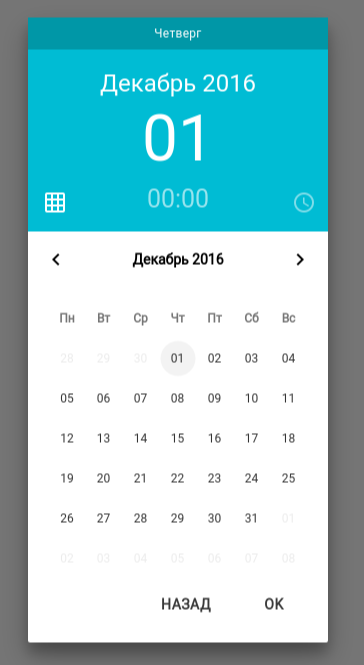
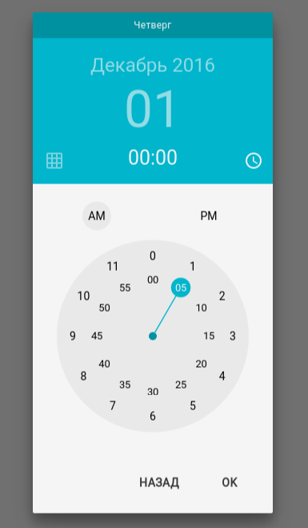

# Material DateTime Picker for React.js

Простой компонент для React'а в стиле Material Design. Без использования jQuery.

Оригинал взят [отсюда](https://github.com/ripjar/material-datetime-picker)




## Установка

~~~
npm install --save react-material-datetimepicker
~~~

## Подключение

Для подключения компонента нужно:

```javascript
import DataTimePicker from 'react-material-datetime-picker';
```

Также, не забудьте подключить файл со стилями

```html
<link rel="stylesheet" href="node_modules/react-material-datetimepicker/build/react-material-datetime-picker.css">
```

## API

По-умолчанию используются внутренние свойства и обработчики. Но при желании, в компонент можно передать свои свойства.

### Параметры

При передачи своих свойств, в компонент необходимо передавать и необходимые обработчики, который должен необходимые свойства.

`type` (*bool*) - активная вкладка: календарь/часы. **По-умолчанию**: true

`hours` (*string*) - часы. **По-умолчанию**, текущий час (по времени, установленному в ОС)

`minutes` (*string*) - минуты. **По-умолчанию**, текущая минута (по времени установленному в ОС)

`day` (*string*) - день. **По-умолчанию**, текущий день (по времени установленному в ОС)

`month` (*string*) - месяц. **По-умолчанию**, текущий месяц (по времени установленному в ОС)

`show` (*bool*) - показывать комонент или скрыть его. **По-умолчанию**, true

`year` (*string*) - год. **По-умолчанию**, текущий год (по времени установленному в ОС)

`weekday` (*string*) - день недели. **По-умолчанию**, текущий день недели (по времени установленному в ОС)

### Обработчики

При передачи своих обработчиков, в компонент необходимо передавать и необходимые свойства, который обработчик должен менять.

`handleChangeType` - Обработчик изменения активной вкладки (календарь/часы)

`handleChangeMonth` - Обработчик изменения месяца

`handleChangeDay` - Обработчик изменения месяца

`handleChangeHours` - Обработчик изменения часов

`handleChangeMinutes` - Обработчик изменения минут

`clickOnCancel` - Обработчик нажатия на кнопку Cancel

`clickOnOK` - Обработчик нажатия на кнопку OK

## Простой пример использования (проще некуда :) )

```javascript
"use strict";

import React, { Component, PropTypes }  from 'react';
import ReactDOM from 'react-dom';

import { DataTimePicker } from './src';

class App extends Component {
    constructor(props) {
        super(props);
    }

    render() {
        return (
            <DataTimePicker />
        );
    }
}

ReactDOM.render(<App />, document.getElementById('app'));

```

## Пример использования с передачей своих свойств и обработчиков
```javascript
/**
* ==========================================================
*       Данный код показывает внутренние свойства и 
*           обработчики, которые по-умолчанию,
*           использует компонент.
* ==========================================================
*/

"use strict";

import React, { Component, PropTypes }  from 'react';
import ReactDOM from 'react-dom';

/**
 * Для удобной работы со временем
 */
import moment from 'moment';
import 'moment/locale/ru';

import DataTimePicker from 'react-material-datetimepicker';

class App extends Component {
    constructor(props) {
        super(props);

        /**
         * Подключаем локаль
         */
        moment.locale('ru');

        /**
         * Состояние, где будут хранится параметры компонента
         * По-умолчанию, дата и время берутся из системного времени
         */
        this.state = {
            type: true, // активная вкладка: false - часы, true - календарь
            hours: moment().format("HH"), // часы
            minutes: moment().format("mm"), // минуты
            day: moment().format("DD"), // день
            show: true, // показать/скрыть компонент
            month: moment().format("MMMM"), // месяц
            year: moment().format("YYYY"), // год
            weekday: moment().format("dddd") // день недели
        }
    }

    /**
     * Обработчик изменения активной вкладки (календарь/часы)
     * @param type
     */
    handleChangeType = (type) => {
        this.setState({
            type: type
        });
    };

    /**
     * Обработчик изменения месяца
     * @param newMonth
     */
    handleChangeMonth = (newMonth) => {
        const {month, year} = this.state;

        if (month === "декабрь" && newMonth === "январь") { // для переключения на следующий год
            const newYear = String(parseInt(year, 10) + 1);

            this.setState({
                month: newMonth,
                year: newYear
            });
        } else if (month === "январь" && newMonth === "декабрь") { // для переключения на предыдущий год
            const newYear = String(parseInt(year, 10) - 1);

            this.setState({
                month: newMonth,
                year: newYear
            });
        } else {
            this.setState({
                month: newMonth
            });
        }
    };

    /**
     * Обработчик изменения дня
     * @param day
     */
    handleChangeDay = (day) => {
        this.setState({
            day: day
        });
    };

    /**
     * Обработчик изменения часов
     * @param hours
     */
    handleChangeHours = (hours) => {
        this.setState({
            hours: moment(String(hours), "HH").format("HH")
        });
    };

    /**
     * Обработчик изменения минут
     * @param minutes
     */
    handleChangeMinutes = (minutes) => {
        this.setState({
            minutes: moment(String(minutes), "mm").format("mm")
        });
    };

    /**
     * Обработчик нажатия на кнопку Cancel
     */
    clickOnCancel = () => {
        const {show} = this.state;
        
        this.setState({
            show: !show,
        });
    };

    /**
     * Обработчик нажатия на кнопку OK
     */
    clickOnOK = () => {
        const {show} = this.state;
        
        this.setState({
            show: !show,
        });
    };

    render() {
        const {type, hours, minutes, day, month, show, year, weekday} = this.state;

        return (
            <DataTimePicker
                type={type}
                hours={hours}
                minutes={minutes}
                day={day}
                month={month}
                show={show}
                year={year}
                weekday={weekday}
                handleChangeType={this.handleChangeType}
                handleChangeMonth={this.handleChangeMonth}
                handleChangeDay={this.handleChangeDay}
                handleChangeHours={this.handleChangeHours}
                handleChangeMinutes={this.handleChangeMinutes}
                clickOnCancel={this.clickOnCancel}
                clickOnOK={this.clickOnOK}
            />
        );
    }
}

ReactDOM.render(<App />, document.getElementById('app'));

```